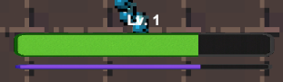
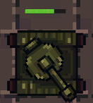
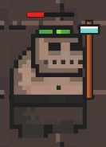
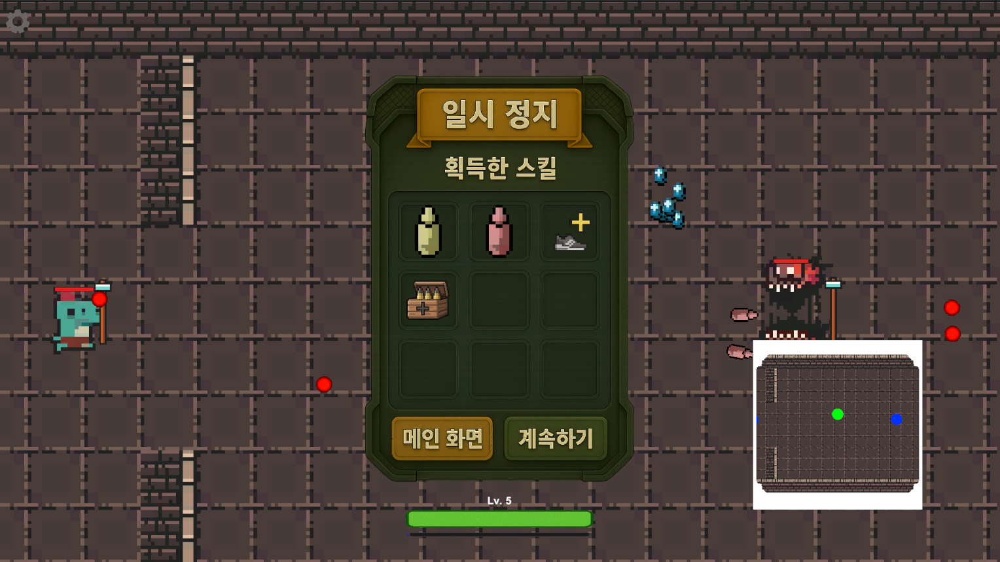
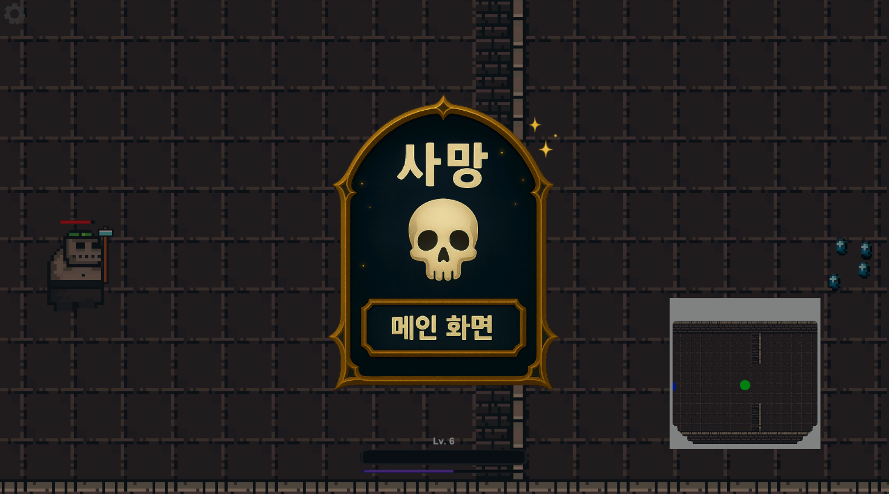

## 📋 구현한 UI 기능

---

### 🎮 1. 플레이어 UI

- **체력 (HP)**  
  플레이어의 현재 체력을 실시간으로 표시합니다.

- **경험치 (EXP)**  
  적 처치 후 떨어지는 오브젝트를 획득 시 증가하는 경험치를 시각화합니다.

- **레벨**  
  현재 플레이어의 레벨 정보를 표시합니다.

- **HP Bar UI**  
  플레이어 머리 위에 항상 표시되는 체력 바를 구현하여 직관적인 상태 확인이 가능합니다.

  
  

---

### 👾 2. 몬스터 UI

- **Monster HP Bar UI**  
  모든 몬스터 개체 위에 실시간으로 체력을 보여주는 UI를 구현하여 전투 상황을 쉽게 파악할 수 있도록 하였습니다.

  

---

### ⚙️ 3. 설정 UI

게임 중 일시정지 시 활성화되며, 다음과 같은 기능을 제공합니다:

- **게임 계속하기**  
  일시정지를 해제하고 게임을 재개합니다.

- **메인화면으로 돌아가기**  
  현재 게임을 종료하고 메인 메뉴로 이동합니다.

- **보유 스킬 확인**  
  현재 플레이어가 보유 중인 스킬 목록을 확인할 수 있는 UI 창을 표시합니다.

  

---

### 💀 4. 사망 UI

플레이어 사망 시 등장하는 UI로, 다음 기능을 제공합니다:

- **메인화면으로 돌아가기**  
  게임을 종료하고 메인 메뉴로 복귀합니다.

  

---

### 🌊 5. 웨이브 UI

웨이브 시스템과 연동하여 현재 게임 진행 상태를 시각적으로 표현합니다:

- **WAVE 1, 2, 3 진행 번호 표기**  
  각 웨이브 시작 시 해당 번호를 화면에 표시합니다.

- **CLEAR**  
  해당 웨이브를 클리어했을 때 시각적으로 알림을 제공합니다.

  
  
  
  

---
